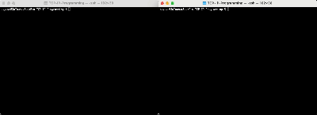
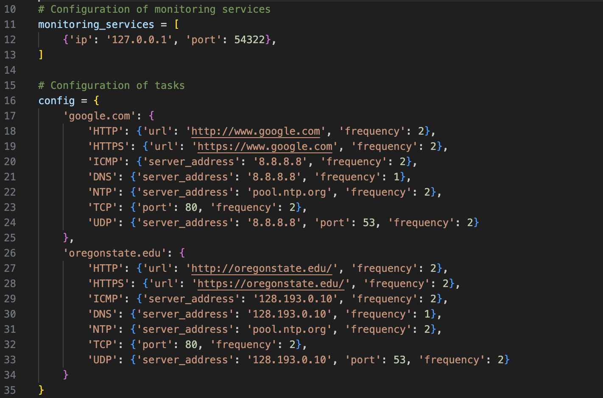

# TCP-IP-Programming

## Overview

Network uptime monitoring utilities are essential tools for networking professionals, providing real-time visibility into network health and performance. By continuously tracking server availability, response times, and traffic patterns, these tools enable early detection of anomalies, security breaches, and performance bottlenecks. This proactive approach ensures minimal downtime, efficient resource allocation, and aids in future network expansion. Detailed logs and statistics generated by these utilities are crucial for trend analysis, compliance audits, and strategic decision-making. In essence, network monitoring utilities empower networking professionals with the data and insights needed to ensure robust, secure, and efficient network operations in today's interconnected and digital-dependent world.

This project consists of two main components: the Monitoring Service and the Management Service. The Management Service configures and manages monitoring tasks, while the Monitoring Service performs the monitoring tasks and reports back to the Management Service. 



## Software Specification in Network Monitoring App

### Network Monitoring Application
- Uses the configuration information to automatically check the status of servers and services.
- Runs continuously using a loop until it is terminated by the user (i.e., this is not a one-time check).

### User-Defined Monitoring Configuration
- A list of servers (IP addresses or domain names) and the services they provide, including HTTP, HTTPS, ICMP, DNS, NTP, TCP, and UDP, are configured for monitoring.
- Parameters for each service are set, such as URL for HTTP/HTTPS, server address for DNS/NTP, port numbers for TCP/UDP, etc.
- The frequency or interval of checks for each service is set.

### Echo Server Implementation
- The `tcp_server()` function sets up a TCP server that listens for incoming connections on a specific IP address (127.0.0.1) and port (12345).

### Echo Client Implementation
- The `tcp_client()` function sets up a TCP client that connects to a server running on the specified IP address (127.0.0.1) and port number (12345).

## Configuration
Open `management_service.py` and add your server and service details:



## Usage
### Start the Monitoring Service
1. Open a terminal and navigate to the directory containing `monitoring_service.py`.
2. Run the script with elevated privileges (necessary for certain network operations):
```bash
sudo python3 monitoring_service.py
```

### Start the Management Service
1. Open another terminal and navigate to the directory containing `management_service.py`.
2. Run the script:
```bash
python3 management_service.py
```

## License
This project is licensed under the MIT License.